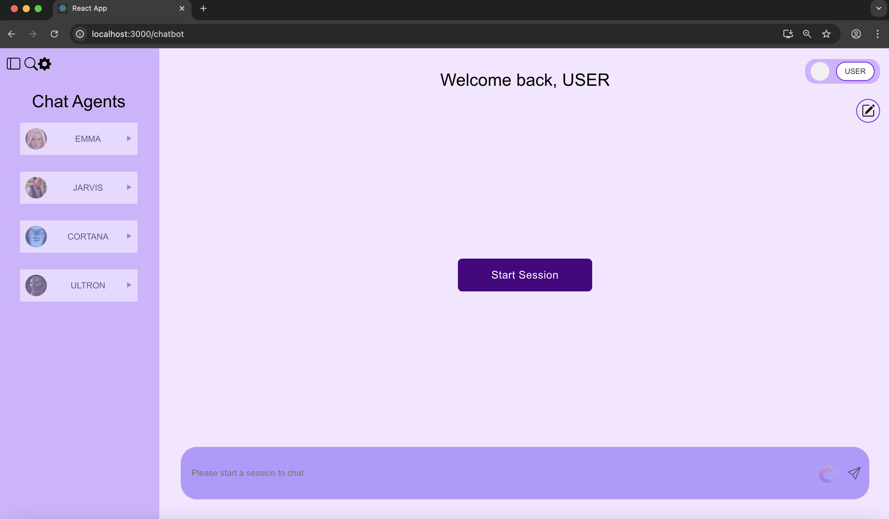
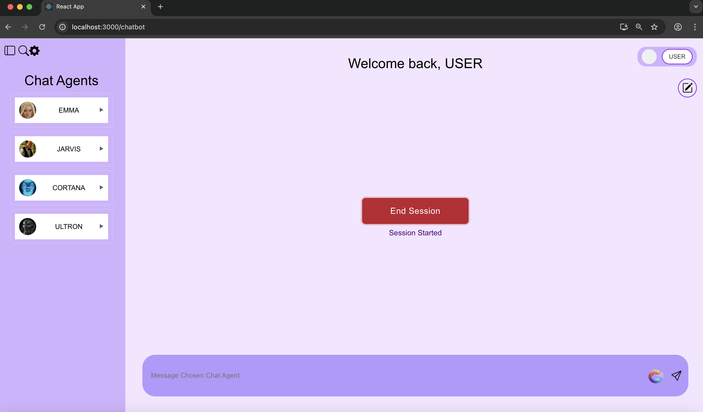

# 🌐 Web Design Projects
This repository is a collection of web designs and features utilizing the tech stack of HTML, CSS, Javascript, and React.JS.

## 🫂 _Loop_, NYU Steinhardt Comission
[onlinegamingbehavior.pbix] (onlinegamingbehavior.png)
Spearheaded development of an innovative platform integrating mental health professionals with a custom-built LLM. Led full-stack development with a front-end focus using ReactJS, CSS, JavaScript, HTML, and Figma for wireframing, while also handling backend integration through Firebase (BaaS, NoSQL) and Unity (C++). Built realistic human models in Unity that interacted with users based on the LLM’s dialogue, creating immersive client–patient simulations. Enabled professionals to evaluate and refine AI responses iteratively, designing seamless interactions between web, AI, and VR environments. Contributed to branding by naming the tool and designing its logo. While built for mental health, Loop’s adaptable architecture demonstrates broad scalability and real-world impact.

